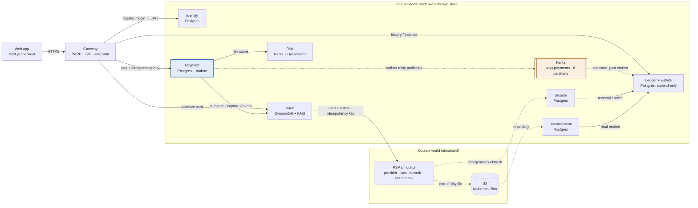
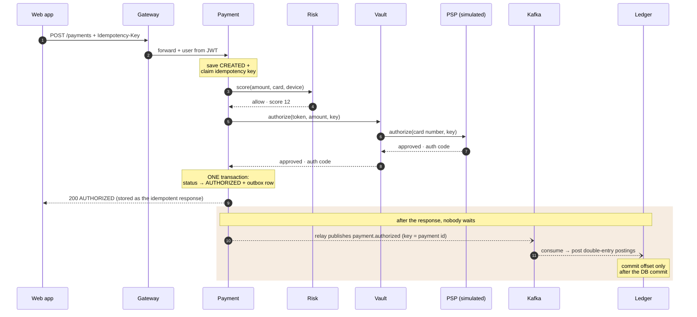
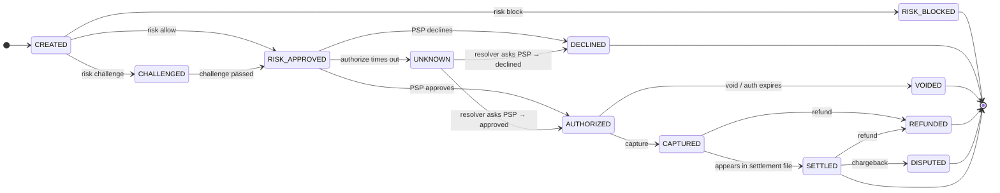

# PayX — architecture diagrams

> Phase 0 design, **proposed**. Decisions behind these pictures are in
> [`DESIGN.md`](../DESIGN.md) §1. Diagrams are Mermaid, so GitHub renders them
> and they can be edited as plain text.

Peak load is ~1,400 payments/second, which is easy. What's hard is keeping
money correct when any hop can fail halfway. Three rules shape everything:

| Rule | Mechanism |
|---|---|
| **Never charge twice** | Idempotency key on every money-moving request; a retry returns the stored result. The key is passed on to the provider too. |
| **Never lose a payment event** | Payment update + event saved in one DB transaction (outbox); a relay publishes to Kafka afterwards. |
| **Never trust a single record** | Double-entry ledger that can only be added to; reconciled daily against the provider's settlement file. |

---

## 1. Who talks to whom

Solid arrows are synchronous HTTP calls (the customer is waiting). Dashed
arrows are asynchronous: Kafka events, files, webhooks (nobody waits).

- **Payment owns the flow but never writes to the ledger itself.** It records
  an event in its outbox, and the Ledger picks it up from Kafka.
- **Card operations reach the provider through Vault**, so raw card numbers
  stay inside one service. This detail gets settled in Phase 3.

---

## 2. One payment, step by step (authorize)

- **Steps 1–11 are what the customer waits for.** Steps 12–13 run later.
- **Why the outbox matters:** if Payment crashes straight after the
  AUTHORIZED transaction, the event is still in its database, and the relay
  publishes it on restart. Nothing is lost.
- **Capture** repeats the Vault → PSP → outbox → Ledger steps with `capture`.
- **If the PSP call times out**, the payment moves to `UNKNOWN` (diagram 3)
  rather than failing.

---

## 3. The states a payment moves through

- **`UNKNOWN` is the doc's timeout problem turned into a real state.** A
  timeout doesn't mean the payment failed, only that we don't know yet.
- **The resolver asks the provider what happened**, using the same
  idempotency key, and never charges a second time. A capture that times out
  goes through the same step.
- **Any transition not drawn here is refused in code.** That is what stops a
  duplicate webhook from capturing twice.

---

## The nine services

| Service | Job | Owns | From the doc? |
|---|---|---|---|
| Gateway | Single entry point: routing, login checks, rate limits | nothing | web servers / load balancer |
| Identity | Register and log in users | Postgres `payx_identity` | user authentication |
| Vault | Swaps card numbers for tokens; the only place card numbers are stored | DynamoDB `payx-card-vault` | **added** |
| Payment | Runs the payment state machine, idempotency, outbox | Postgres `payx_payments` | payment service |
| Risk | Scores a payment: allow / challenge / block | Redis, DynamoDB `payx-risk-decisions` | fraud detection + risk check, **merged** |
| Ledger | Double-entry record that can only be added to, plus merchant balances | Postgres `payx_ledger` | ledger + wallet, **merged** |
| Reconciliation | Daily check of the ledger against the settlement file | Postgres `payx_recon` | reconciliation system |
| Dispute | Refunds and chargebacks | Postgres `payx_disputes` | dispute management |
| PSP simulator | Plays the provider, card network and bank, with failures you can switch on | its own state, S3 files | **stand-in** for the outside world |
